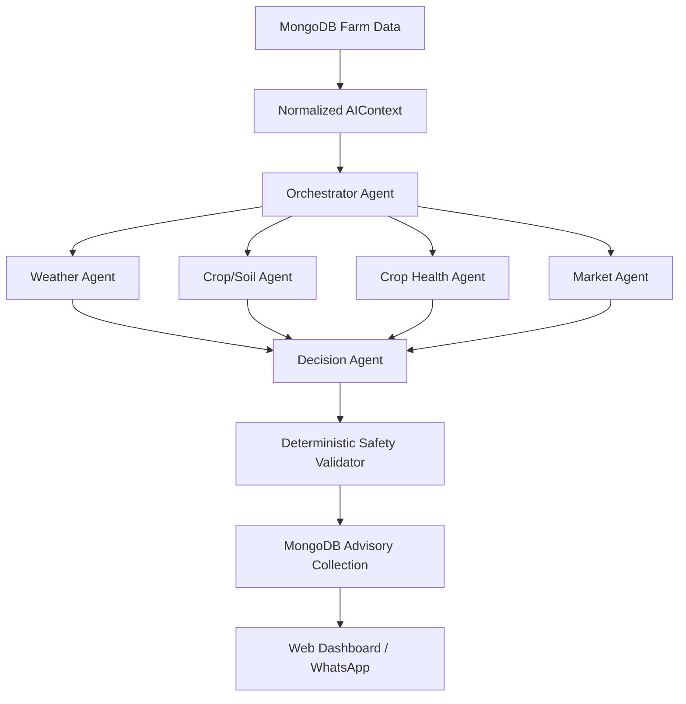

# Sujalam 2.0 — AI Multi-Agent Decision Engine Architecture

## Overview
The deterministic rule-based Decision Engine in Sujalam 2.0 has been upgraded to a true Multi-Agent Architecture powered by OpenRouter. This pipeline executes specialized agents in parallel to interpret farm data, resolves conflicts via a central Decision Agent, and deterministically validates the final output using a Safety Validator before persisting to MongoDB.

## Architecture

## Agent Responsibilities

1. **Orchestrator Agent:** Interprets the user's implicit/explicit intent and dictates which specialized agents should be executed for cost and speed optimization.
2. **Weather Agent:** Evaluates raw weather data (rain probability, temp) to warn about heat stress, rain risk, and irrigation viability.
3. **Crop Agent:** Analyzes soil moisture and crop stages to recommend water and nutrient needs.
4. **Crop Health Agent:** Synthesizes verified disease/health diagnosis outputs into actionable advice. It is strictly prohibited from inventing diseases.
5. **Market Agent:** Interprets pre-calculated market prices and trends to advise on holding or selling produce.
6. **Decision Agent:** Collects outputs from the parallel specialized agents, detects conflicts (e.g. low soil moisture but heavy rain expected tomorrow), and issues a final, single recommendation for the farmer.

## Fallback Behavior & Confidence Capping

Because AI gateways like OpenRouter can fail (timeout, 429, no API key, malformed JSON), Sujalam 2.0 employs robust Graceful Degradation:

- **Mock Provider (`MockAIProvider`):** Automatically engages if `OPENROUTER_API_KEY` is missing or if `AI_PROVIDER=mock`. It returns deterministic agent responses for safe CI/CD and development.
- **Provider Pipeline Failure:** If the AI pipeline crashes critically, `decisionEngine.ts` falls back to a purely deterministic subset of rules to ensure the Web and WhatsApp services never crash.
- **Missing Data Handling:** If a sensor or data point is missing (e.g., no weather data), the system explicitly instructs the AI that the data is missing. The deterministic **Safety Validator** explicitly caps the `confidence` score of the resulting decision to `< 50%`.

## Deterministic Safety Validator

The AI is **never** the final authority. The `aiSafetyValidator.ts` evaluates the `DecisionAgentResult` using strict rules.

**Key Overrides:**
- **Flood Prevention:** If the AI recommends `IRRIGATE` but the soil moisture is already high (>60%), the Validator overrides it to `SKIP` or `WAIT` to prevent crop damage.
- **Rain Awareness:** If the AI recommends `IRRIGATE` but heavy rain is expected (>60% probability), the Validator overrides to `WAIT`.

## Environment Variables

| Variable | Description |
|---|---|
| `AI_PROVIDER` | `openrouter` or `mock`. Defaults to `mock`. |
| `OPENROUTER_API_KEY` | Required if using OpenRouter. |
| `OPENROUTER_MODEL` | Defaults to `openai/gpt-4o-mini`. |
| `AI_TIMEOUT_MS` | Defaults to `15000` (15 seconds) to prevent webhook timeouts. |
