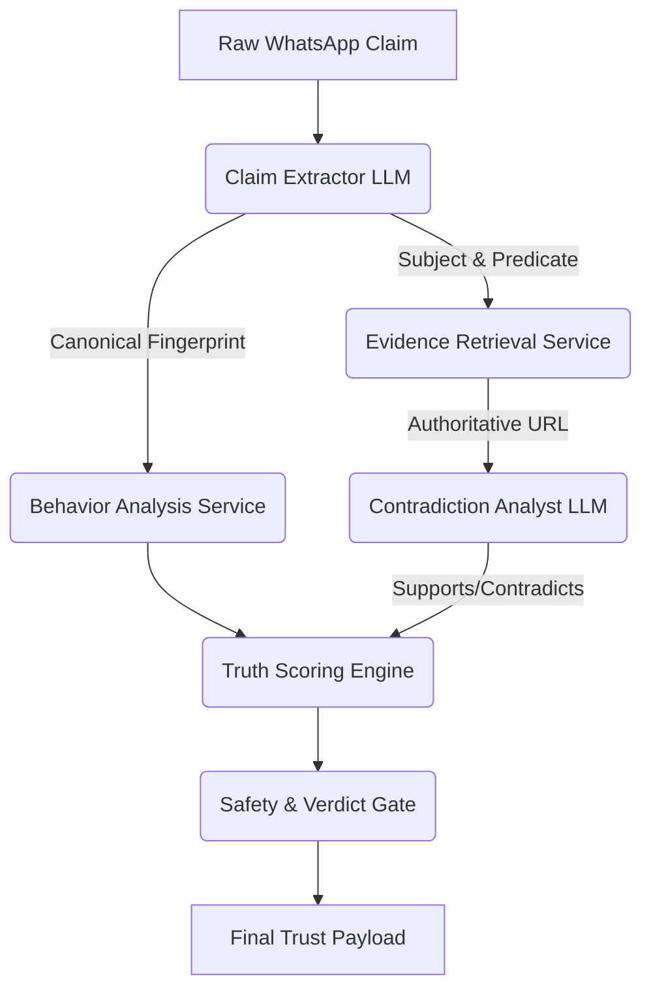

# TRUTHGUARD 2.0

TruthGuard is an evidence-first agricultural trust boundary that intercepts and analyzes user-submitted claims (e.g., WhatsApp forwards) before they can be treated as factual information by the AI Decision Engine.

## Core Principle
**AI acts solely as an analyst, not an authority.** 
The final verdict, safety risk, and truth score are determined deterministically based on source authority, evidence contradiction, and propagation volume. The LLM only extracts claims and evaluates linguistic contradiction.

## Architecture

## Source Authority Registry
Sources are strictly categorized deterministically:
- **LEVEL_1**: Primary Official Government Portals (e.g., pmkisan.gov.in, agricoop.nic.in)
- **LEVEL_2**: Recognized Institutions (e.g., ICAR, IARI)
- **LEVEL_3**: Secondary Orgs (e.g., NABARD, SFAC)
- **LEVEL_4**: News/Media
- **LEVEL_5**: Social Media / User Generated

## Truth Scoring vs Risk Scoring
TruthGuard intentionally separates "virality" from "falseness":
- **Truth Score**: Based solely on authoritative evidence support vs contradiction.
- **Propagation Risk**: Volume of duplicate claims seen in a time window.
- **Coordination Risk**: Burstiness of identical claims.
- **Safety Risk**: Extremely high if the claim recommends unverified agricultural treatments.

## Safety Gate
Any claim related to `TREATMENT` or `CROP_DISEASE` must have Level 1 or Level 2 supporting evidence. If it doesn't, it is automatically blocked with `POTENTIALLY_DANGEROUS` and `human_review_required: true`.

## Blackout Resilience Integration
If the primary MongoDB database is offline, TruthGuard bypasses standard Mongoose schemas and writes verifications to the append-only `events.log` with `PENDING_RECOVERY_SYNC`, ensuring no audit data is lost during the blackout.

## Demo
Visit `/trust-demo` to run live evaluation scenarios proving the architecture separates AI generation from deterministic source authority.
